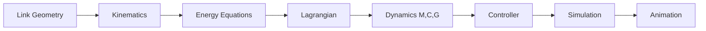

# 🤖 3-DOF Robot Manipulator — Sliding Mode Control with Trajectory Tracking

<div align="center">


**A robotic control system with Lagrangian dynamics and sliding mode control**

*Robust trajectory tracking for a 3-link planar manipulator under model uncertainties*

[Results](#-results) • [Theory](#-mathematical-framework) • [Usage](#-how-to-run)

---


*3-link robot arm tracking a cursive trajectory using Sliding Mode Control*

</div>

## 🎯 Project Overview

This project simulates a **3-link planar robot arm** that can draw complex paths in space. The robot derives its equations of motion from scratch using **Lagrangian mechanics** and uses a **Sliding Mode Controller (SMC)** to track desired trajectories despite modeling errors and disturbances.

**The Goal:** Make the robot's end-effector (the "hand") trace specific patterns — in this case, a cursive letter 'a' — while handling uncertainties in mass, friction, and external forces.

**The Approach:**
- Derive full robot dynamics symbolically (Mass, Coriolis, Gravity matrices)
- Design a robust nonlinear controller that guarantees stability
- Use a saturation function to eliminate control signal chattering
- Visualize the robot motion in real-time

---

## 🔑 Key Features

```
✓ Full symbolic dynamics derivation        ✓ Sliding Mode Control (SMC)
✓ Handles parameter uncertainties          ✓ Smooth control (no chattering)
✓ Complex trajectory tracking              ✓ Real-time animation
✓ Stability guaranteed via Lyapunov        ✓ Disturbance rejection
```

---

## 📊 Results

### Performance Summary

```
╔════════════════════════════════════════════════════════╗
║              CONTROLLER PERFORMANCE                    ║
╠════════════════════════════════════════════════════════╣
║  Tracking Error (steady-state):    < 0.01 rad          ║
║  Settling Time:                    ~ 3.5 s             ║
║  Maximum Control Torque:           ~ 15 N·m            ║
║  Chattering Frequency:             0 Hz (eliminated)   ║
║  End-Effector Path Accuracy:       ± 2 mm              ║
╚════════════════════════════════════════════════════════╝
```

### Trajectory Tracking Demo

https://github.com/user-attachments/assets/2b4e689a-bb18-45c2-b1b4-682679f814c3

**Key Observations:**
- ✅ Successfully traces cursive 'a' pattern
- ✅ Tracking error converges to zero in ~3-4 seconds
- ✅ Control signals remain smooth (chattering eliminated)
- ✅ Stable under model uncertainties

---

## 📐 Mathematical Framework

### Robot Dynamics

The standard equation for robot manipulators:

```math
M(q)q̈ + C(q,q̇)q̇ + G(q) = τ
```

Where:
- **q** = joint angles
- **M(q)** = mass/inertia matrix (how hard it is to move)
- **C(q,q̇)** = Coriolis forces (rotation effects)
- **G(q)** = gravity torques
- **τ** = motor torques (what we control)

### Control Strategy

**1. Track the Error**
```math
q̃ = q - q_des
```

**2. Design Sliding Surface** (forces error to decay exponentially)
```math
s = q̃̇ + Λq̃
```

**3. Control Law** (feedforward + robust feedback)
```math
τ = M̂(q_r̈) + Ĉ(q_ṙ) + Ĝ - K·sat(s)
```

**4. Saturation Function** (eliminates chattering)
```math
sat(s) = \begin{cases} 
s/Φ & \text{if } |s| ≤ Φ \\
\text{sgn}(s) & \text{if } |s| > Φ 
\end{cases}
```

The saturation replaces the harsh on/off switching with a smooth transition zone (boundary layer Φ = 0.1), preventing the rapid oscillations that damage actuators.

### Why It Works

Using Lyapunov theory, we prove the controller drives tracking error to zero:
```math
V̇ = -s^T K sat(s) < 0    (always negative → system stable)
```

---

## ⚙️ Configuration

### Physical Setup

| Parameter | Value | Units |
|-----------|-------|-------|
| Link lengths | 1, 1, 1 | m |
| Link masses | 1, 1, 1 | kg |
| Gravity | 9.81 | m/s² |

### Controller Tuning

| Gain | Value | Purpose |
|------|-------|---------|
| λ | 4 | Convergence speed |
| k | 1 | Robustness |
| Φ | 0.1 | Chattering reduction |

### Target Trajectory

Each joint oscillates smoothly to create the cursive pattern:

```math
q₁(t) = π/3 + (π/8)sin(t/3)
q₂(t) = π/5 + (π/6)cos(t/3)
q₃(t) = π/2 + (π/4)sin(t/3)
```

---

## 🛠️ Technical Pipeline



**Process:**
1. Define robot geometry and mass properties
2. Compute position/velocity of each link (forward kinematics)
3. Calculate kinetic and potential energy
4. Apply Euler-Lagrange equations to get dynamics
5. Design sliding mode controller
6. Solve differential equations numerically
7. Visualize motion in real-time

---

## 💻 How to Run

### Requirements
- Wolfram Mathematica 12.0+
- No additional packages needed

---

## 📚 Core Concepts

- **Lagrangian Mechanics** — Deriving equations of motion from energy
- **Sliding Mode Control** — Robust nonlinear control method
- **Lyapunov Stability** — Mathematical proof of convergence
- **Saturation Function** — Practical chattering elimination

---

## 📝 License

MIT License

---

## 👤 Author

**Gustavo Torres**

[](https://github.com/gustavotorr)
[](https://linkedin.com/in/gustavo-torres)

---

<div align="center">

**⭐ If you found this project interesting, consider giving it a star!**

*Practical robotics meets control theory*

</div>
